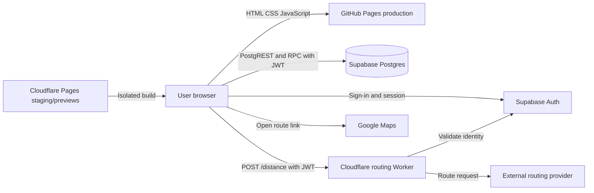
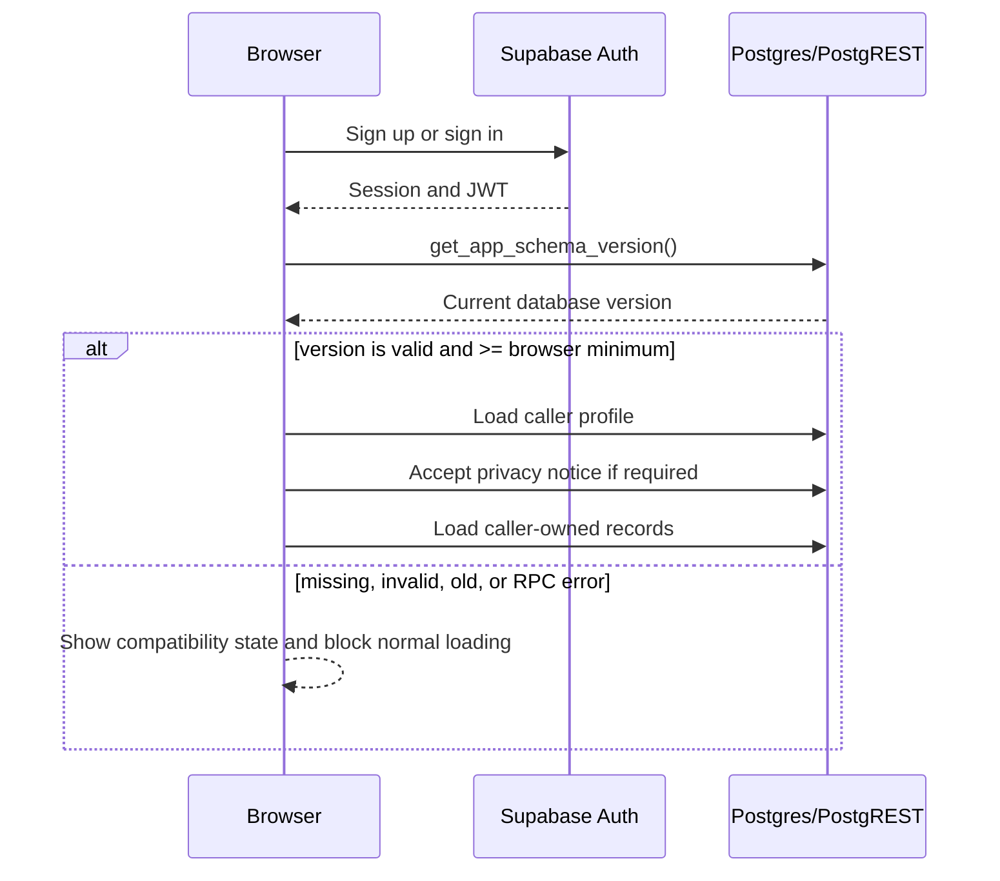
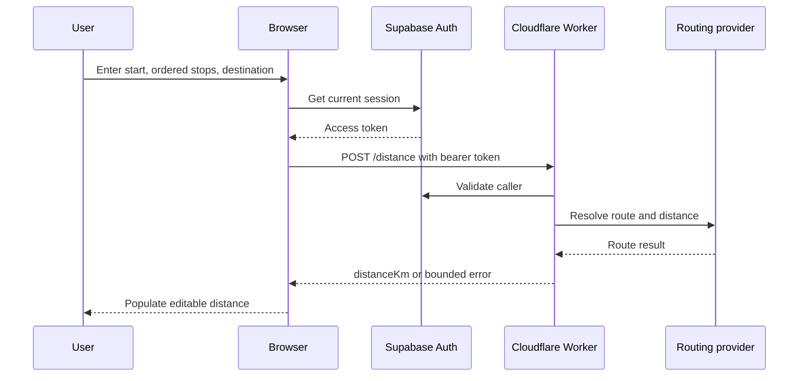

# Travel Log Architecture

## Status and scope

This document describes current `main` after the schema-version-3 release and local calendar-date fix. It does not describe roadmap ideas as deployed infrastructure. The routing Worker is separately maintained; only its checked-in client contract and repository operational guidance can be verified here.

## System overview

Travel Log is a dependency-light static browser application. GitHub Pages serves production assets. Browser JavaScript communicates directly with Supabase Auth, PostgREST, and RPCs, and calls a protected Cloudflare Worker for route distance. There is no repository-owned application server, framework, bundler, or server-rendering layer.

## Repository responsibilities

- `index.html`, `styles.css`, `theme.js`: application shell, forms, responsive styling, and theme persistence.
- `app.js`: authentication/session orchestration, rendering, Supabase data access, trip/account workflows, routing requests, and exports.
- `logic.js`: testable validation, filtering, dates, totals, recording-mode behaviour, and Australian calculations.
- `report.html`, `report.css`, `report.js`: printable report view.
- `config.js`: public production browser endpoints and publishable Supabase key; it must never contain privileged secrets.
- `supabase/`: bootstrap schema and ordered repository-owned migrations.
- `scripts/build-staging.cjs`: isolated staging build and production-endpoint guardrails.
- `tests/`: credential-free Node tests plus an explicitly configured live Supabase integration suite.
- `.github/`: App checks, CodeQL, Dependabot, and the PR checklist.

## Browser responsibilities

The browser renders authentication, dashboard, trip, account, saved-location, logbook, annual-odometer, privacy, and report workflows. It maps database rows to UI models, performs client-side validation/calculation, sends authenticated CRUD/RPC requests, obtains a session token for routing, creates Google Maps links, and generates client-side exports.

Client checks improve UX but are not a security boundary. `app.js` remains a large orchestration module and is intentionally documented as technical debt rather than refactored here.

## Supabase, authentication, and sessions

Supabase provides email/password identity and recovery, persistent sessions, PostgREST, PostgreSQL integrity/RLS, profile creation, and three public RPC contracts:

- `get_app_schema_version()` for authenticated compatibility checks;
- `accept_privacy_notice(text)` for the caller's profile;
- `delete_my_account()` for recently reauthenticated callers.

The current repository/database application schema version is **3** and the browser minimum supported version is **3**. `app.js` rejects only when the returned version is invalid or lower than the minimum; a future version greater than 3 remains accepted under this model.

## Conceptual data model

| Resource | Purpose | Ownership/integrity |
|---|---|---|
| `auth.users` | Supabase identity | Managed by Supabase Auth |
| `profiles` | Name, privacy acceptance, theme, recording mode | `id` equals authenticated user ID |
| `trips` | Calendar dates, ordered route, distance, purpose/project, claim/rate, vehicle/odometer, notes | `user_id`; `stops` is canonical JSONB ordered string array |
| `saved_locations` | Private label/address suggestions | `user_id` |
| `logbook_periods` | Representative vehicle logbook periods | `user_id` |
| `logbook_income_years` | Annual odometer records | `user_id`; composite foreign key enforces same-owner logbook link |
| `private.app_schema_state` | Current application schema version | No direct browser table access |

PostgreSQL constraints enforce important date ranges, odometer relationships, lengths, reasonable distance/rate limits, JSON-array shape, logbook duration, and same-owner relationships.

## Tenant ownership and RLS

RLS is enabled on all five application-owned tables. Authenticated policies compare `auth.uid()` with `user_id` (or profile `id`) for the permitted CRUD operations; anonymous table privileges are revoked. Public RPC wrappers have narrow grants and call restricted private helpers where privileged execution is required.

The live staging integration suite uses two synthetic authenticated users and covers own/cross-user select, insert, update, ownership reassignment, delete, composite ownership, privacy acceptance, schema version, and account deletion. It previously completed 40 authenticated isolation subtests within 41 total passing integration tests with no successful cross-user access. The suite is opt-in and refuses the known production project.

## Trip lifecycle

1. `openForm()` prepares a new, duplicate, or existing trip.
2. New and duplicate dates use device-local `tripCalendarDates()` defaults; edit retains stored dates.
3. The user supplies ordered addresses/stops, purpose, distance or odometers, and optional reporting fields.
4. `validateTrip()` checks domain rules without converting calendar dates through UTC ISO strings.
5. `toDatabase()` maps to database columns and includes the signed-in user ID.
6. PostgREST performs insert/update/delete; RLS and constraints enforce server-side ownership and integrity.
7. The browser reloads and renders the user's records. Deletes require confirmation.

Edits overwrite the row. There is no trip-change or manual-distance audit history.

## Distance and address flows

The Worker is a trust and privacy boundary because it receives user tokens and route addresses. Operational documents say it restricts origins, validates users, rate-limits, and keeps the routing-provider key outside the browser; its implementation is not in this repository.

Address assistance currently comes from the signed-in user's `saved_locations` rendered through an escaped HTML `datalist`. Current `main` contains no remote `/suggest` autocomplete flow.

## Australian rules and calculations

`logic.js` contains financial-year selection, effective-year ATO cents-per-kilometre rates from 2015–16, unpublished-future-year refusal, the 5,000 work-kilometre cap per vehicle and income year, claim summaries, logbook duration/validity/business percentage, annual estimates, and recording-mode preservation. Unit tests cover important boundaries. Explicit rule IDs and authoritative-source metadata are still missing.

These are estimates and record-keeping aids, not personalised tax advice.

## Reporting and exports

- CSV is generated from the active filtered data and protects cells against spreadsheet-formula execution.
- JSON account export includes the profile and all four related resource collections plus a UTC generation timestamp.
- Print/PDF transfers a report payload through same-origin `sessionStorage`; `report.html` consumes/removes it and relies on browser Print / Save PDF.
- Google Maps route links provide external route viewing; they do not persist calculated distance.

Downloads and printed files leave Travel Log's control. Automated browser-level report reconciliation remains limited.

## Environments, migrations, and recovery

| Concern | Production | Staging/previews |
|---|---|---|
| Static hosting | GitHub Pages from `main` | Cloudflare Pages generated build |
| Supabase | Production project | Separate staging project |
| Routing | Production Worker | Separate staging Worker configuration required |
| Client config | Committed public `config.js` | Build environment variables |
| Safety UI | Live label | Persistent staging banner and `noindex` |

The staging builder refuses production endpoints, privileged-looking credentials, non-HTTPS URLs, and missing configuration. A successful build or preview does not by itself prove the staging Worker is active; that remains an operational verification gap.

`supabase/migrations.json` owns migration order. The schema-v3 release reconciled production drift, corrected `delete_my_account()`, and aligned repository, staging, production, and the browser minimum at version 3. Production migration work follows preflight, recovery-point, encrypted connection, staging-first, post-migration verification, and synthetic-test discipline.

A private logical production backup was checksum-verified and restored to disposable PostgreSQL 17; application schema/data and reconciliation behaviour were validated. Recovery remains **PARTIALLY VERIFIED** because managed Supabase Auth, Storage, Vault, and related runtime were not fully reproduced. Restore-to-clean-database is preferred over an ambiguous in-place reverse migration.

## CI, dependencies, and trust boundaries

- GitHub Actions runs `npm test` with Node 24 for PRs and `main`.
- CodeQL scans JavaScript on PRs, `main`, and weekly; Dependabot checks npm and Actions weekly.
- The browser loads pinned `@supabase/supabase-js` 2.112.3 from jsDelivr with SRI.
- External services are Supabase, GitHub Pages/Actions, Cloudflare Pages/Worker, the routing provider, Google Maps, and jsDelivr.
- Public endpoints and publishable keys are visible by design; service-role/database/routing-provider secrets must not enter browser assets.
- Browser input is untrusted. Supabase RLS/constraints are the data security boundary.
- Route addresses cross the Worker/provider boundary; report payloads briefly enter `sessionStorage`; exports leave application control.

There is no lint/type-check command, automated general-purpose browser/E2E suite, production error monitor, or automated application/routing/schema health check in current `main`.

## Calendar dates and timestamps

Trip dates, logbook periods, and filters are calendar dates represented as local `YYYY-MM-DD` and PostgreSQL `date`. Device-local defaults must not use `toISOString().slice(0, 10)`. Actual instants—creation/update, privacy acceptance, and export/report generation—use UTC ISO strings or PostgreSQL `timestamptz`. Intentional UTC arithmetic is used for whole-day logbook spans so DST-hour changes do not alter day counts.

## Business-logic locations

- `logic.js`: reusable domain rules, validation, dates, filters, and calculations.
- `app.js`: browser workflow, rendering, mapping, persistence, auth, routing, and exports.
- Supabase migrations: ownership, integrity, RPCs, deletion, and compatibility.
- `report.js`: report rendering and report-facing calculations.

This split is partial; future extraction should be incremental and protected by browser-flow tests.
